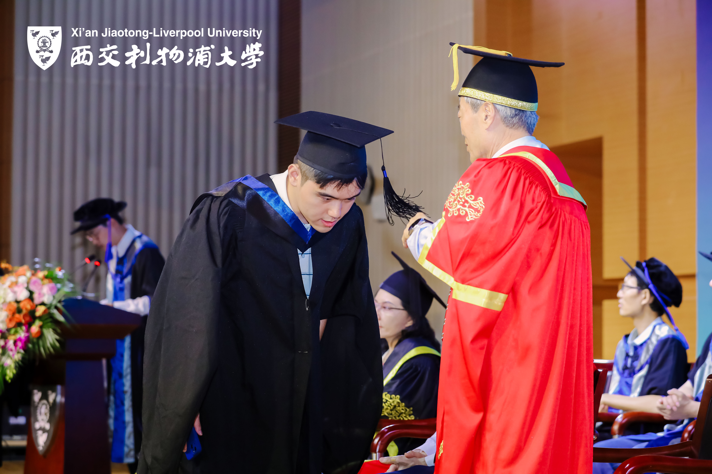
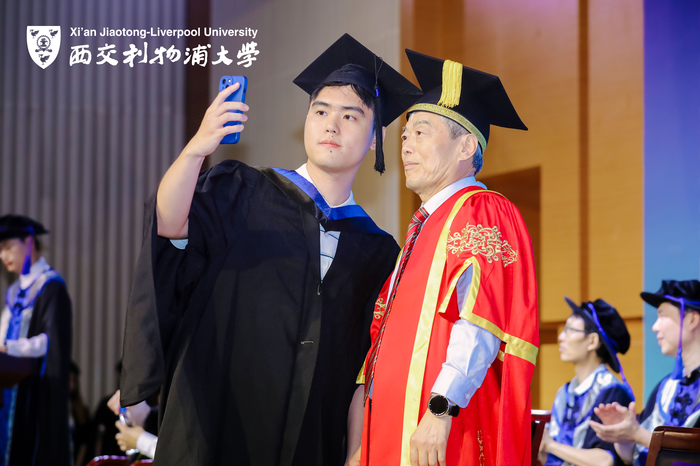
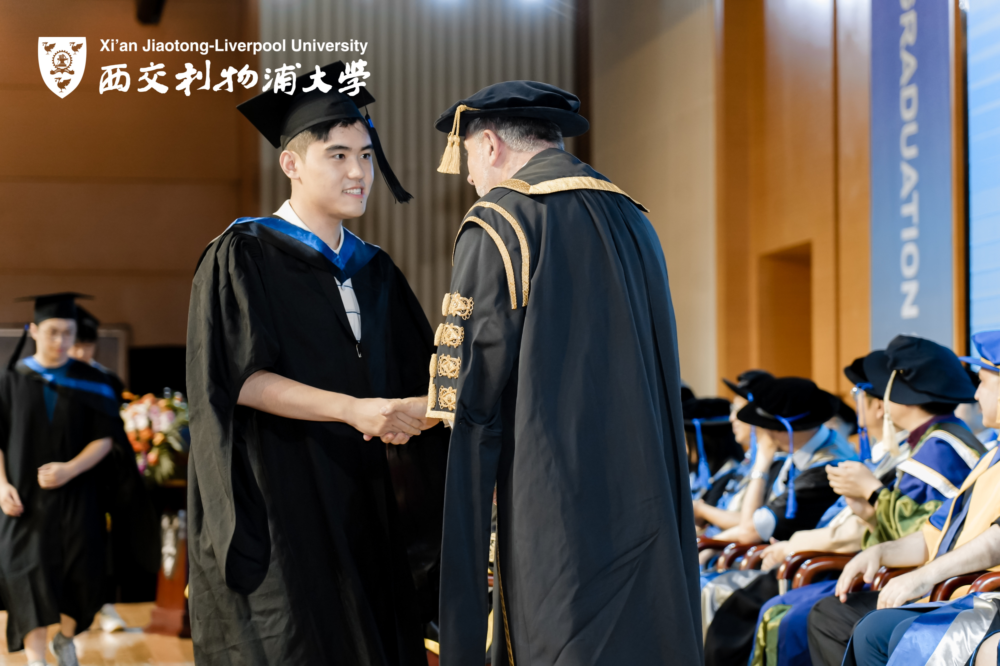

# About Me

Here is **Yifei Shen (Barry, 沈逸飞)**.

I am a first-year master's student at the University of Washington, Seattle, in the Department of Electrical and Computer Engineering. Prior to joining the University of Washington, I received my BEng in Digital Media Technology from Xi'an Jiaotong-Liverpool University and Liverpool University in 2024, where I was advised by [Prof. Jieming Ma](https://scholar.xjtlu.edu.cn/en/persons/JiemingMa). During my undergraduate studies, my research focused on Computer Vision (CV), Human–Computer Interaction (HCI), Large Language Models (LLMs). I plan to join the University of Florida's undergraduate computer science program in Spring 2025 to continue my computer science degree. So, go Gators!

If you are interested in any aspect of me, I would love to chat and collaborate, please email me at - *yifeis02[at]uw[dot]edu* or *yifei.shen[at]ufl[dot]edu*

## Academic Background

- **Jan 2025 - Future:** University of Florida (BS, Computer Science)
- **Sep 2024 - Future:** University of Washington (MS in ECE)
- **Sep 2020 - July 2024:**  Liverpool University (BEng, Digital Media Technology)
- **Sep 2020 - July 2024:**  Xi'an Jiaotong-Liverpool University (BEng, Digital Media Technology)
- **Jan 2022 - March 2022:** [Massachusetts Institute of Technology (Winter School, 2.5 CEUs)](https://xpro.mit.edu/certificate/3e48237c-fcae-44f7-9991-b43feddf783a/)

---

## Research Interests

- Computer Vision (CV)
- Human–Computer Interaction (HCI)
- Large Language Models (LLMs)

I am currently a remote intern at Yale NLP Lab, focusing on LLMs and AI Agents. 

---

## News and Updates

- **Sep 7 2024：**Received a certificate for participating in the [CCAI Virtual Summer School 2024](file/Climate Change AI Summer School 2024 Certificate of Attendance - YIFEI SHEN.pdf).
   
  

    
  

- **Aug 1 2024：**Successfully graduated from Xi'an Jiaotong-Liverpool University and was awarded the Bachelor’s degree in Engineering from both Xi'an Jiaotong-Liverpool University and the University of Liverpool.
   
  

    
    
    
  

- **March 31 2024：**[I've been accepted to the CCAI Virtual Summer School 2024](file/CCAI%20Virtual%20Summer%20School%202024%20Offer.pdf)!
- **March 7 2022：**Completed the [winter course](https://courses.xpro.mit.edu/learn/course/course-v1:xPRO+MLxTouchEdu1+SPOC_R6/home) offered by MIT: [Machine Learning, Modeling, and Simulation Principles](https://xpro.mit.edu/certificate/3e48237c-fcae-44f7-9991-b43feddf783a/)!

    

